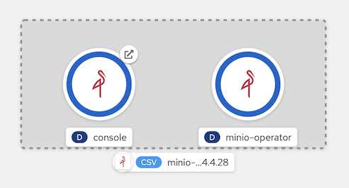
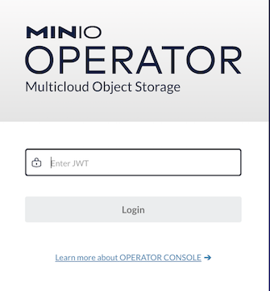
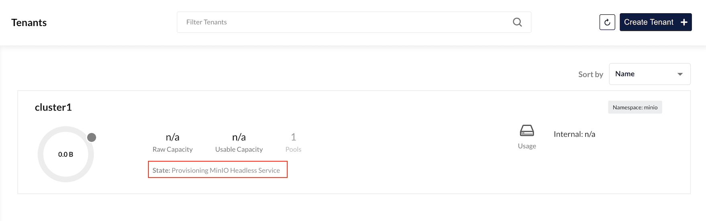
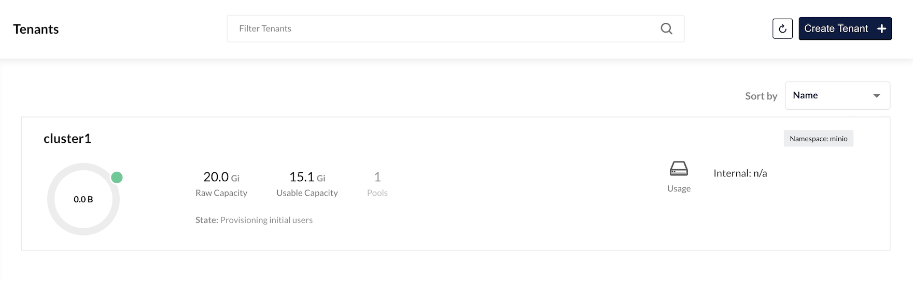
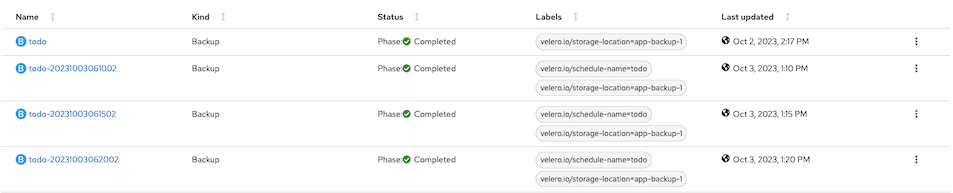
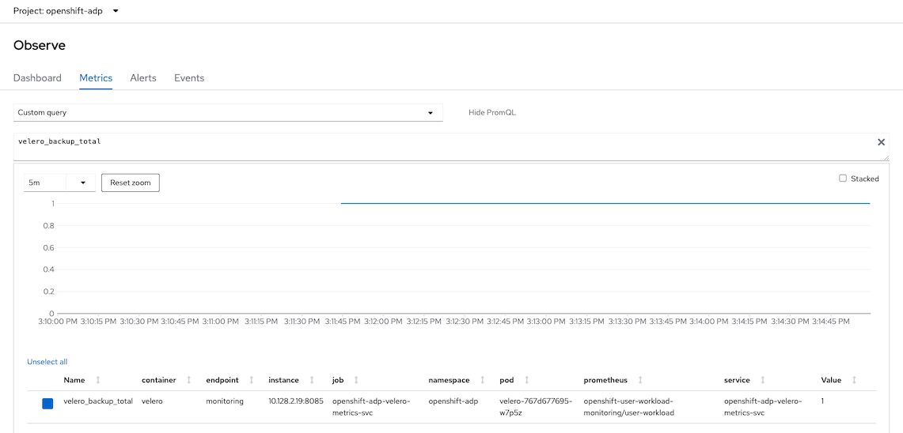
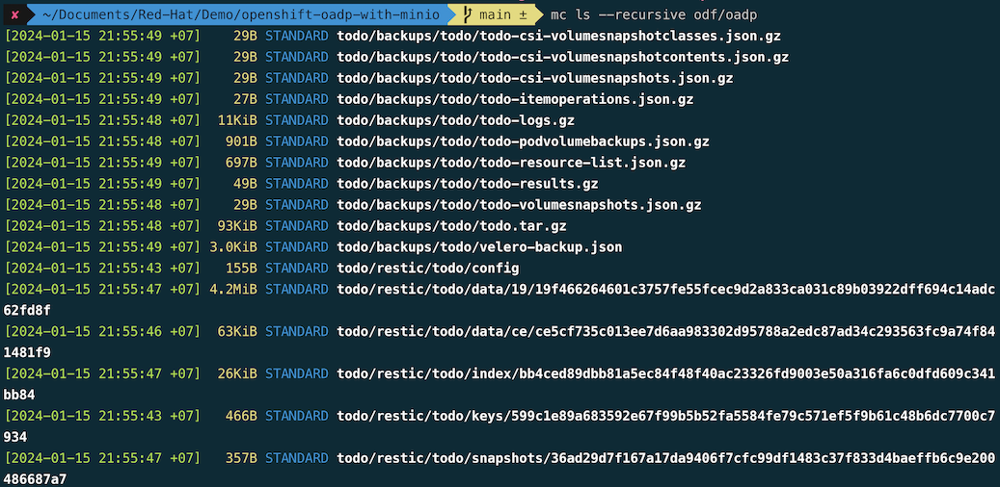

# OADP
- [OADP](#oadp)
  - [Object Storage Preparation](#object-storage-preparation)
    - [ODF](#odf)
    - [AWS S3](#aws-s3)
    - [MinIO](#minio)
  - [Sample Todo App](#sample-todo-app)
  - [OADP Operator](#oadp-operator)
    - [Backup](#backup)
    - [Schedule Backup](#schedule-backup)
    - [Restore](#restore)
  - [Monitor OADP](#monitor-oadp)
  - [Restore from another cluster](#restore-from-another-cluster)
- [Minio Client](#minio-client)

## Object Storage Preparation
Prepare your Object Storage configuration. In case of Amazon S3
- Bucket
- Region
- Access Key ID
- Access Key
### ODF
- Prepare Object Storage configuration including S3 access Key ID, access Key Secret, Bucket Name, endpoint and Region
- Create Bucket
  - Admin Console
    - Navigate to Storage -> Object Storage -> Object Bucket Claims
    - Create ObjectBucketClaim
      - Claim Name: *oadp*
      - StorageClass: *openshift-storage.nooba.io*
      - BucketClass: *nooba-default-bucket-class*
                        
  - Command line with [oadp-odf-bucket.yaml](config/oadp-odf-bucket.yaml)
                
    ```bash
    oc create -f config/oadp-odf-bucket.yaml
    ```
  - Retrieve configuration into environment variables

    ```bash
    S3_BUCKET=$(oc get ObjectBucketClaim oadp -n openshift-storage -o jsonpath='{.spec.bucketName}')
    REGION="us-east-1"
    ACCESS_KEY_ID=$(oc get secret oadp -n openshift-storage -o jsonpath='{.data.AWS_ACCESS_KEY_ID}'|base64 -d)
    SECRET_ACCESS_KEY=$(oc get secret oadp -n openshift-storage -o jsonpath='{.data.AWS_SECRET_ACCESS_KEY}'|base64 -d)
    ENDPOINT="https://s3.openshift-storage.svc:443"
    DEFAULT_STORAGE_CLASS=$(oc get sc -A -o jsonpath='{.items[?(@.metadata.annotations.storageclass\.kubernetes\.io/is-default-class=="true")].metadata.name}')
    ``` 

### AWS S3
- This demo use existing S3 bucket used by OpenShift's Image Registry
  
  ```bash
  S3_BUCKET=$(oc get configs.imageregistry.operator.openshift.io/cluster -o jsonpath='{.spec.storage.s3.bucket}' -n openshift-image-registry)
  AWS_REGION=$(oc get configs.imageregistry.operator.openshift.io/cluster -o jsonpath='{.spec.storage.s3.region}' -n openshift-image-registry)
  AWS_ACCESS_KEY_ID=$(oc get secret image-registry-private-configuration -o jsonpath='{.data.credentials}' -n openshift-image-registry|base64 -d|grep aws_access_key_id|awk -F'=' '{print $2}'|sed 's/^[ ]*//')
  AWS_SECRET_ACCESS_KEY=$(oc get secret image-registry-private-configuration -o jsonpath='{.data.credentials}' -n openshift-image-registry|base64 -d|grep aws_secret_access_key|awk -F'=' '{print $2}'|sed 's/^[ ]*//')

  ```
### MinIO

- Install Minio Operator from OperatorHub
  
  


- Install [minIO kubctl plugin](https://docs.min.io/minio/k8s/tenant-management/deploy-minio-tenant-using-commandline.html)


- Initial tenant
  
  ```bash
  kubectl minio init -n openshift-operators
  ```

- Check service on namespace openshift-operators
  
  ```bash
  oc get svc/console -n openshift-operators
  ```

  Output

  ```bash
  NAME      TYPE        CLUSTER-IP       EXTERNAL-IP   PORT(S)             AGE
  console   ClusterIP   172.30.109.205   <none>        9090/TCP,9443/TCP   11m
  ```

- Create route for MinIO console
  
  ```bash
  oc create route edge minio-console --service=console --port=9090 -n openshift-operators
  ```

  

- Login with JWT token extracted from secret

  ```bash
  oc get secret/console-sa-secret -o jsonpath='{.data.token}' -n openshift-operators | base64 -d
  ```
  
  

- Create project minio
  
  ```bash
  oc new-project minio --description="Object Storage for OADP"
  ```

- Check ID from minio

  ```bash
  oc get ns minio -o=jsonpath='{.metadata.annotations.openshift\.io/sa\.scc\.supplemental-groups}'
  ```
    
  Write down the number before slash (/). You need this ID when configure tenant

- Create tenant with MinIO Console
  - Setup: tenant name, namespace, capacity and requests/limits
    
    

  - Configure: Disable expose MinIO Service and Console (We will create OpenShift's route manually) enable security context with number extracted from namespace supplemental-groups

    
  
  - Pod placement: Set to None in case your environment is small not have many nodes to do pod anti-affinity
    
    

  - Identiy Provider: add user
  
    

  - Security: Disable TLS

    

  - Audit: Disabled
  - Monitoring: Disabled
  - Click Create and wait for tenant creation

    

- Edit Security Context for console
  - Login to OpenShift Admin Console
  - Select namespace minio
  - Operators->Installed Operators->Minio Operator->Tenant
  - Edit YAML. Add following lines to spec:
    
    ```yaml
    console:
      securityContext:
        fsGroup: <supplemental-groups>
        runAsGroup: <supplemental-groups>
        runAsNonRoot: true
        runAsUser: <supplemental-groups> 
    ```

- Verify that Tenant is up and running

  

  Details

  

  check stateful set

  ```bash
  oc get statefulset -n minio
  ```

  Output

  ```bash
  NAME              READY   AGE
  cluster1-pool-0   4/4     18m
  ```

- Verify CPU and Memory consumed by MinIO in namesapce minio
  
  CPU utilization 

  

  Memory utilization

  

- Create Route for Tenant Console

  ```bash
  oc create route edge oadp-console --service=oadp-console --port=9090 -n minio
  ```

- Create Route for Minio

  ```bash
  oc create route edge minio --service=minio -n minio
  ```

- Login to tenant console with user you specified while creating tenant and create bucket name cluster1 
  
  Login page

  

  Create bucket

  

- Create Service Account for OADP
  
  

## Sample Todo App

- Deploy todo app to namespace todo with kustomize.
  
  ```bash
  oc create -k todo-kustomize/overlays/jvm
  ```
  Output

  ```bash
  namespace/todo created
  secret/todo-db created
  service/todo created
  service/todo-db created
  persistentvolumeclaim/todo-db created
  deployment.apps/todo created
  deployment.apps/todo-db created
  servicemonitor.monitoring.coreos.com/todo created
  route.route.openshift.io/todo created
  ```
- Setup Database
  
  ```bash
  TODO_DB_POD=$(oc get po -l app=todo-db -n todo --no-headers|awk '{print $1}')
  oc cp config/todo.sql $TODO_DB_POD:/tmp -n todo
  oc exec -n todo $TODO_DB_POD -- psql -Utodo -dtodo -a -f /tmp/todo.sql
  ```

  Output

  ```bash
  drop table if exists Todo;
  DROP TABLE
  drop sequence if exists hibernate_sequence;
  DROP SEQUENCE
  create sequence hibernate_sequence start 1 increment 1;
  CREATE SEQUENCE
  create table Todo (
        id int8 not null,
        completed boolean not null,
        ordering int4,
        title varchar(255),
        url varchar(255),
        primary key (id)
      );
  CREATE TABLE
  alter table if exists Todo
      add constraint unique_title unique (title);
  ALTER TABLE
  ```

- Add couple of your tasks to todo app
  
  
  
## OADP Operator

- Install OADP Operator from OperatorHub

  

- Edit file [credentials-velero](credentials-velero) with ID and key of Service Account you created for tenant.

  ```ini
  [default]
  aws_access_key_id=<ID>
  aws_secret_access_key=<KEY>
  ```

- Create credentials for OADP to access MinIO bucket

  ```bash
  oc create secret generic cloud-credentials -n openshift-adp --from-file cloud=credentials-velero
  ```

- Create [DataProtectionApplication](config/DataProtectionApplication.yaml)
  
  - Check for
    - REGION
    - ENDPOINT
    - S3_BUCKET

    ```yaml
    apiVersion: oadp.openshift.io/v1alpha1
    kind: DataProtectionApplication
    metadata:
      name: app-backup
      namespace: openshift-adp
    spec:
      backupImages: false
      configuration:
        nodeAgent:
          enable: true
          uploaderType: kopia
        velero:
          defaultPlugins:
            - aws
            - openshift 
            - csi
      backupLocations:
        - velero:
            config:
              profile: "default"
              region: REGION # In case of minio, use minio
              s3Url: ENDPOINT 
              insecureSkipTLSVerify: "true"
              s3ForcePathStyle: "true"
            provider: aws
            default: true
            credential:
              key: cloud
              name: cloud-credentials # Default. Can be removed 
            objectStorage:
              bucket: S3_BUCKET
              prefix: todo
    ```

- Run following command
  
  ```bash
  cat config/DataProtectionApplication.yaml \
      |sed 's/S3_BUCKET/'$S3_BUCKET'/' \
      |sed 's|ENDPOINT|'$ENDPOINT'|' \
      |sed 's|REGION|'$REGION'|' \
      |oc apply -f -
  ```

- Verify that BackupStorageLocation is ready
  
  ```bash
  oc get BackupStorageLocation -n openshift-adp
  oc get BackupStorageLocation app-backup-1 -n openshift-adp -o jsonpath='{.status}'
  ```
  
  Output
  
  ```
  NAME           PHASE       LAST VALIDATED   AGE     DEFAULT
  app-backup-1   Available   20s              3m48s   true
  {"lastSyncedTime":"2024-07-01T08:47:06Z","lastValidationTime":"2024-07-01T08:47:06Z","phase":"Available"}
  ```
  
  

### Backup

- Create [backup configuration](config/backup-todo.yaml) for namespace todo

  ```yaml
  apiVersion: velero.io/v1
  kind: Backup
  metadata:
    name: todo
    labels:
      velero.io/storage-location: default
    namespace: openshift-adp
  spec:
    defaultVolumesToRestic: true
    hooks: {}
    includedNamespaces:
    - todo
    storageLocation: app-backup-1 
    ttl: 720h0m0s
  ```

  Run following command

  ```bash
  oc create -f config/backup-todo.yaml
  ```

- Verify backup status
  
  ```bash
  oc get backup/todo -n openshift-adp -o jsonpath='{.status}'|jq
  ```
  
  Output
  
  ```json
  {
    "backupItemOperationsAttempted": 1,
    "backupItemOperationsCompleted": 1,
    "completionTimestamp": "2024-07-01T09:18:48Z",
    "expiration": "2024-07-31T09:18:04Z",
    "formatVersion": "1.1.0",
    "phase": "Completed",
    "progress": {
      "itemsBackedUp": 68,
      "totalItems": 68
    },
    "startTimestamp": "2024-07-01T09:18:04Z",
    "version": 1
  }
  ```
<!-- 
  Test with 10GB data

  ```json
  {
    "completionTimestamp": "2022-10-12T12:51:45Z",
    "expiration": "2022-11-11T12:50:18Z",
    "formatVersion": "1.1.0",
    "phase": "Completed",
    "progress": {
      "itemsBackedUp": 89,
      "totalItems": 89
    },
    "startTimestamp": "2022-10-12T12:50:18Z",
    "version": 1
  }
  ``` -->
- Use velero cli to check backup
  - Config velero client to use namespace openshift-adp
    
    ```bash
    velero client config set namespace=openshift-adp
    ```

  - List backup
    
    ```bash
    velero get backup
    ```
    
    output
    
    ```bash
    NAME   STATUS      ERRORS   WARNINGS   CREATED                         EXPIRES   STORAGE LOCATION   SELECTOR
    todo   Completed   0        0          2024-07-01 16:18:04 +0700 +07   28d       app-backup-1       <none>
    ```
    
- Check data in S3 bucket with mc command
    - Config alias
      
      ```bash
      mc alias set oadp https://<URL> $ACCESS_KEY_ID $SECRET_ACCESS_KEY
      ```

    - List data in bucket
      
      ```bash
      mc ls --recursive oadp/$S3_BUCKET
      ```

      Output

      ```bash
      [2024-07-01 16:18:18 +07]    29B STANDARD todo/backups/todo/todo-csi-volumesnapshotclasses.json.gz
      [2024-07-01 16:18:18 +07]    29B STANDARD todo/backups/todo/todo-csi-volumesnapshotcontents.json.gz
      [2024-07-01 16:18:18 +07]    29B STANDARD todo/backups/todo/todo-csi-volumesnapshots.json.gz
      [2024-07-01 16:18:46 +07]   371B STANDARD todo/backups/todo/todo-itemoperations.json.gz
      [2024-07-01 16:18:17 +07]  11KiB STANDARD todo/backups/todo/todo-logs.gz
      [2024-07-01 16:18:18 +07]    29B STANDARD todo/backups/todo/todo-podvolumebackups.json.gz
      [2024-07-01 16:18:18 +07]   791B STANDARD todo/backups/todo/todo-resource-list.json.gz
      [2024-07-01 16:18:18 +07]    49B STANDARD todo/backups/todo/todo-results.gz
      [2024-07-01 16:18:18 +07]    29B STANDARD todo/backups/todo/todo-volumesnapshots.json.gz
      [2024-07-01 16:18:48 +07]  95KiB STANDARD todo/backups/todo/todo.tar.gz
      [2024-07-01 16:18:48 +07] 3.1KiB STANDARD todo/backups/todo/velero-backup.json
      ```
      
  <!-- - Check data in MinIO
    
     -->

### Schedule Backup

- Create [schedule](config/schedule-todo.yaml) for backup namespace todo
  
  ```yaml
  apiVersion: velero.io/v1
  kind: Schedule
  metadata:
    name: todo
    namespace: openshift-adp
  spec:
    defaultVolumesToRestic: true
    schedule: '*/5 * * * *' # Backup every 5 minutes for demo purpose. 
    template:
      hooks: {}
      includedNamespaces:
      - todo
      storageLocation: app-backup-1 
      defaultVolumesToRestic: true 
      ttl: 720h0m0s
  ```

  Create schedule backup

  ```bash
  oc create -f config/schedule-todo.yaml
  ```
  
  - Check result after schedule is created. 
  ```bash
  oc get schedule/todo -n openshift-adp -o jsonpath='{.status}'   
  ```
  
  Output
  
  ```json
  {
    "lastBackup": "2023-10-03T06:20:02Z",
    "phase": "Enabled"
  }
  ```

  Check in developer console

  

### Restore
  
- Delete deployment and pvc in namespace todo
  
  ```bash
  oc delete deployment/todo-db -n todo
  oc delete pvc todo-db -n todo
  ```

- List backup name and select

  ```bash
  oc get backup -n openshift-adp
  ```
  
  Output
  
  ```bash
  NAME                  AGE
  todo                  3m18s
  todo-20220830135132   3m18s
  todo-20220830140034   3m18s
  todo-20220830141034   3m18s
  todo-20220830142634   18m
  ```

  Or use OpenShift Admin Console

  

- Edit [restore-todo.yaml](config/restore-todo.yaml) and replace spec.backupName with name from previous step.
  
  ```yaml
  apiVersion: velero.io/v1
  kind: Restore
  metadata:
    name: todo
    namespace: openshift-adp
  spec:
    backupName: BACKUP_NAME 
    excludedResources:
    - nodes
    - events
    - events.events.k8s.io
    - backups.velero.io
    - restores.velero.io
    - resticrepositories.velero.io
    - route
    restorePVs: true
  ```
 
  Run following command
  
  ```bash
  BACKUP_NAME=<backup name>
  cat config/restore-todo.yaml| sed 's/BACKUP_NAME/'$BACKUP_NAME'/' |  oc create -f -
  ```
  
  Check for restore status
  
  ```bash
  oc get restore/todo -n openshift-adp -o yaml|grep -A8 'status:'
  ```

  Output
  
  ```yaml
  status:
    phase: InProgress
    progress:
      itemsRestored: 47
      totalItems: 47
    startTimestamp: "2022-08-30T14:28:53Z"
  ```
    
  Output when restoring process is completed
  
  ```yaml
  status:
    completionTimestamp: "2022-08-30T14:29:32Z"
    phase: Completed
    progress:
      itemsRestored: 47
      totalItems: 47
    startTimestamp: "2022-08-30T14:28:53Z"
    warnings: 5
  ```

- Verify todo apps.

## Monitor OADP
- Ensure that user workload monitoring is enabled by checking configmap cluster-monitoring-config in namespace openshift-monitoring
  
  ```yaml
  data:
    config.yaml: |
      enableUserWorkload: true
  ```
  
  Create [configmap](config/cluster-monitoring-config.yaml) in case of it is not configured yet.

  ```bash
  oc create -f config/cluster-monitoring-config.yaml
  ```
  
  Verify user workload monitoring

  ```bash
  oc -n openshift-user-workload-monitoring get pods
  ```

  Output

  ```bash
  NAME                                  READY   STATUS    RESTARTS   AGE
  prometheus-operator-cf59f9bdc-ktcvg   2/2     Running   0          3m23s
  prometheus-user-workload-0            6/6     Running   0          3m22s
  prometheus-user-workload-1            6/6     Running   0          3m22s
  thanos-ruler-user-workload-0          4/4     Running   0          3m16s
  thanos-ruler-user-workload-1          4/4     Running   0          3m16s
  ```
- Check for metrics
  
  ```bash
  oc exec -n todo \
  $(oc get po -n todo -l app=todo --no-headers|awk '{print $1}'|head -n 1) \
  -- curl -s http://openshift-adp-velero-metrics-svc.openshift-adp:8085/metrics
  ```

  Output

  ```
  # TYPE velero_restore_failed_total counter
  velero_restore_failed_total{schedule=""} 0
  # HELP velero_restore_partial_failure_total Total number of partially failed restores
  # TYPE velero_restore_partial_failure_total counter
  velero_restore_partial_failure_total{schedule=""} 0
  # HELP velero_restore_success_total Total number of successful restores
  # TYPE velero_restore_success_total counter
  velero_restore_success_total{schedule=""} 2
  # HELP velero_restore_total Current number of existent restores
  # TYPE velero_restore_total gauge
  velero_restore_total 1  
  ```

- Create [Service Monitor](config/velero-service-monitor.yaml) for Velero service
  
  ```bash
  oc create -f config/velero-service-monitor.yaml
  ```

- Use Developer Console to verify Velero's metrics
  
  


  Backup Total Metrics

  
  
- Install Grafana Operator
  - Create project

    ```bash
    oc new-project application-monitor --display-name="App Dashboard" --description="Grafana Dashboard for Application Monitoring"
    ```
  
  - Install Grafana Operator to project application-monitor
    
    

- Create [Grafana instance](config/grafana.yaml)
  
  ```bash
  oc apply -f config/grafana.yaml -n application-monitor
  watch -d oc get pods -n application-monitor
  ```
  
  Sample Output
  
  ```bash
  NAME                                                   READY   STATUS    RESTARTS   AGE
  grafana-deployment-bbffb76b6-lb7r9                     1/1     Running   0          28s
  grafana-operator-controller-manager-6b5cf867c8-b5tql   1/1     Running   0          5m29s
  ```

- Add cluster role `cluster-monitoring-view` to Grafana ServiceAccount

  ```bash
  oc adm policy add-cluster-role-to-user cluster-monitoring-view \
  -z grafana-sa -n application-monitor
  ``` 
- Create [Grafana DataSource](config/grafana-datasource.yaml) with serviceaccount grafana-serviceaccount's token and connect to thanos-querier
  
  ```bash
  TOKEN=$(oc create token grafana-sa -n application-monitor)
  cat config/grafana-datasource.yaml|sed 's/Bearer .*/Bearer '"$TOKEN""'"'/'|oc apply -n application-monitor -f -
  ```  
  Output
  
  ```bash
  grafanadatasource.grafana.integreatly.org/grafana-datasource created
  ```
<!-- - Create [Dashboard](config/grafana-dashboard.yaml)

  ```bash
  oc create -f config/grafana-dashboard.yaml
  ```  -->
- Grafana Dashboard (WIP)
## Restore from another cluster
- Install OADP operator
- Create secret cloud-credentials to access minio bucket
- Create [DataProtectionApplication](config/DataProtectionApplication.yaml) with s3url point to minio's route
- Create [Restore](config/restore-todo.yaml)

# Minio Client
- Install [Minio Client](https://github.com/minio/mc)
  - For OSX
    
    ```bash
    brew install mc
    ```
- Configure alias to MinIO/S3 compat
  
  ```bash
  mc alias set <alias name> <URL> <ACCESS_KEY_ID> <SECRETKEY>
  mc alais ls
  ```
- List bucket
  
  ```bash
  mc ls --recursive <alias>/<bucket>
  ```

  Example

  

  
- Copy from bucket cluster1 to current directory
  
  ```bash
  mc cp --recursive minio/cluster1 .
  ```

  Output
  
  ```bash
  ...re-todo-results.gz: 19.52 MiB / 19.52 MiB ━━━━━━━━━━━━━━━━━━━━━━━━━━━━━━━━━━━━━━━━━━━━━━━━━━━━━━━━━━━━━━━━━━ 2.27 MiB/s 8s
  ```

- Verify data
  
  ```bash
  cluster1
  └── oadp
      ├── backups
      │   └── todo
      │       ├── todo-csi-volumesnapshotclasses.json.gz
      │       ├── todo-csi-volumesnapshotcontents.json.gz
      │       ├── todo-csi-volumesnapshots.json.gz
      │       ├── todo-logs.gz
      │       ├── todo-podvolumebackups.json.gz
      │       ├── todo-resource-list.json.gz
      │       ├── todo-volumesnapshots.json.gz
      │       ├── todo.tar.gz
      │       └── velero-backup.json
      ├── restic
      │   └── todo
  ```

- Copy from local to minio

  ```bash
  mc cp --recursive cluster1/oadp minio/cluster1
  ```

  Output

  ```bash
  .../restore-todo-results.gz: 19.52 MiB / 19.52 MiB ━━━━━━━━━━━━━━━━━━━━━━━━━━━━━━━━━━━━━━━━━━━━━━━━━━━━━━━━━━━━━━━━━━━━━━━━━━━━━━━━━━━━━━━━━━━━━━ 4.83 MiB/s 4s
  ```

