# OADP with MinIO
- [OADP with MinIO](#oadp-with-minio)
  - [MinIO](#minio)
  - [Sample Todo App](#sample-todo-app)
  - [OADP Operator](#oadp-operator)
    - [Backup](#backup)
    - [Schedule Backup](#schedule-backup)
    - [Restore](#restore)

## MinIO
- Install Minio Operator from OperatorHub
  
  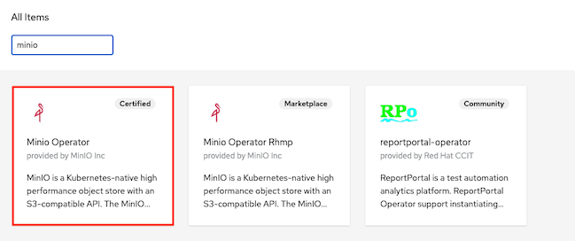


- Install [minIO kubctl plugin](https://docs.min.io/minio/k8s/tenant-management/deploy-minio-tenant-using-commandline.html)


- Initial tenant
  
  ```bash
  kubectl minio init -n openshift-operators
  ```

- Check service on namespace openshift-operators
  
  ```bash
  oc get svc/console -n openshift-operators
  ```

  Output

  ```bash
  NAME      TYPE        CLUSTER-IP       EXTERNAL-IP   PORT(S)             AGE
  console   ClusterIP   172.30.109.205   <none>        9090/TCP,9443/TCP   11m
  ```

- Create route for MinIO console
  
  ```bash
  oc create route edge minio-console --service=console --port=9090 -n openshift-operators
  ```

- Login with JWT token extracted from secret

  ```bash
  oc get secret/console-sa-secret -o jsonpath='{.data.token}' -n openshift-operators | base64 -d
  ```
- Create project minio
  
  ```bash
  oc new-project minio --description="Object Storage for OADP"
  ```

- Check ID from minio

  ```bash
  oc get ns minio -o=jsonpath='{.metadata.annotations.openshift\.io/sa\.scc\.supplemental-groups}'
  ```
    
  Write down the number before slash (/). You need this ID when configure tenant

- Create tenant with MinIO Console
  - Setup: tenant name, namespace, capacity and requests/limits
    
    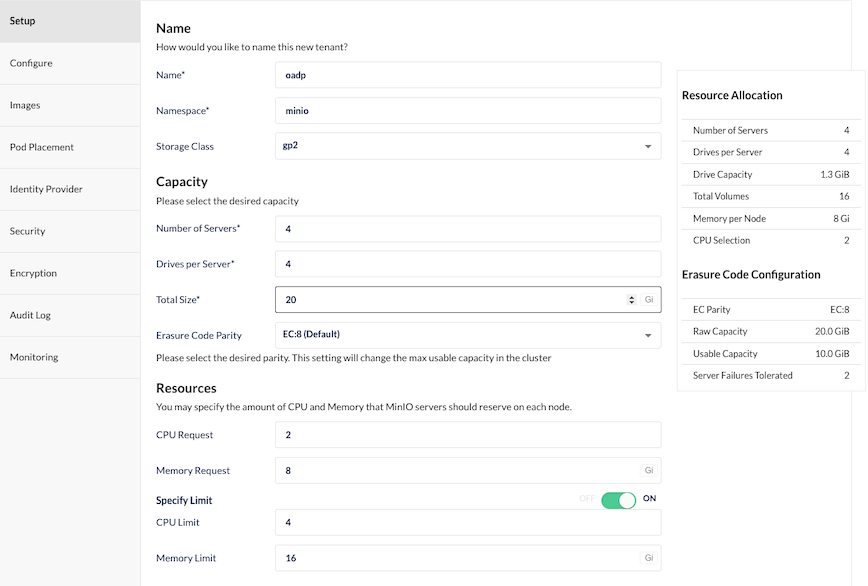

  - Configure: Disable expose MinIO Service and Console (We will create OpenShift's route manually) enable security context with number extracted from namespace supplemental-groups

    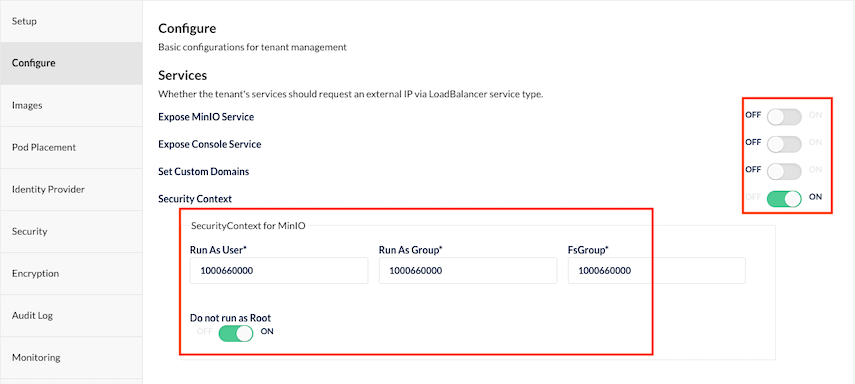
  
  - Pod placement: Set to None in case your environment is small not have many nodes to do pod anti-affinity
    
    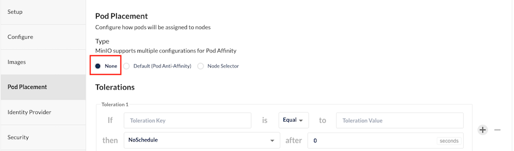

  - Identiy Provider: add user
  
    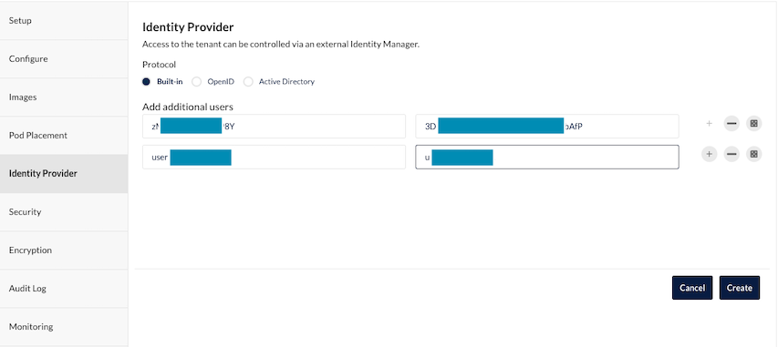

  - Security: Disable TLS

    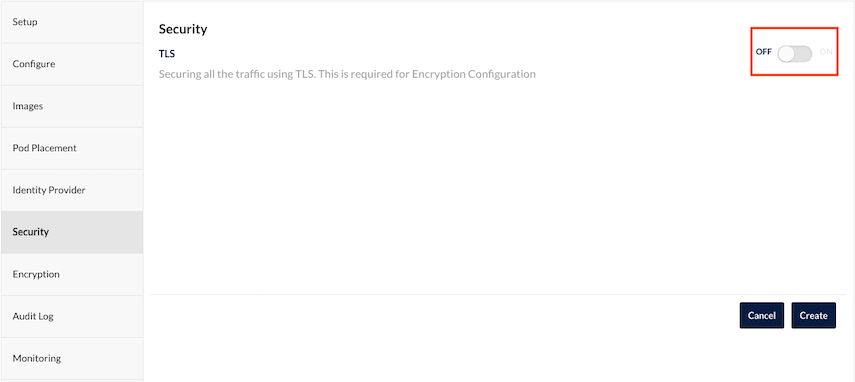

  - Audit: Disabled
  - Monitoring: Disabled
  - Click Create

- Edit Security Context for console
  - Login to OpenShift Admin Console
  - Operators->Installed Operators->Minio Operator->Tenant
  - Edit YAML. Add following lines to spec:
    
    ```yaml
    console:
      securityContext:
        fsGroup: <supplemental-groups>
        runAsGroup: <supplemental-groups>
        runAsNonRoot: true
        runAsUser: <supplemental-groups> 
    ```
- Verify that Tenant is up and running

  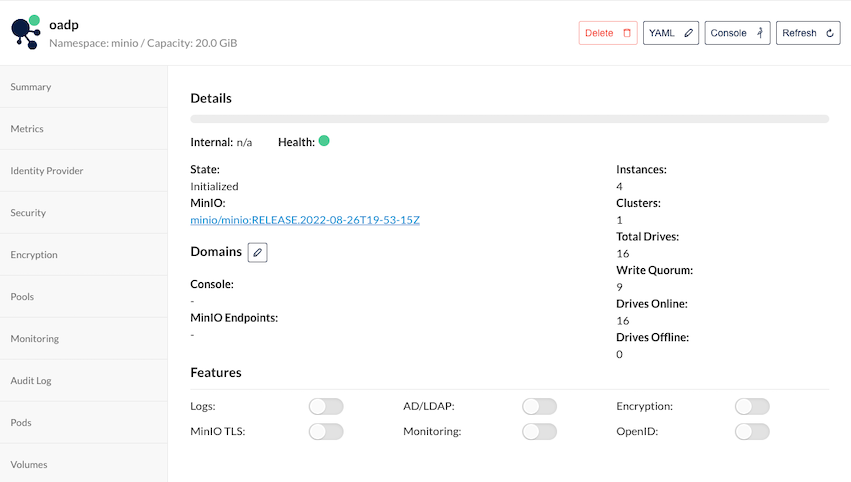

- Create Route for Tenant Console

  ```bash
  oc create route edge oadp-console --service=oadp-console --port=9090 -n minio
  ```

- Verify CPU and Memory consumed by MinIO in namesapce minio
  
  CPU utilization 

  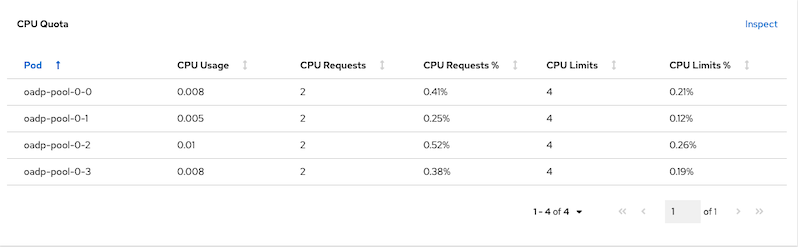

  Memory utilization

  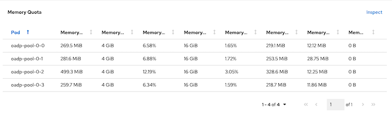

- Login to tenant console with user you specified while creating tenant and create bucket name cluster1 
  
  Login page

  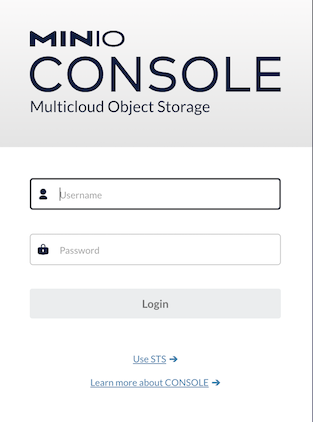

  Create bucket

  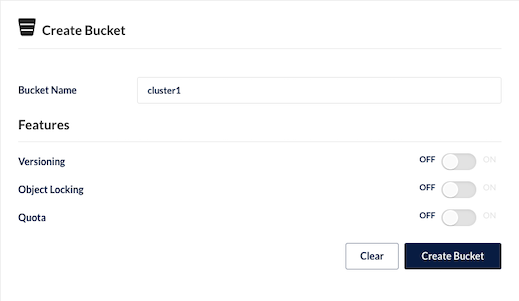

- Create Service Account for OADP
  
  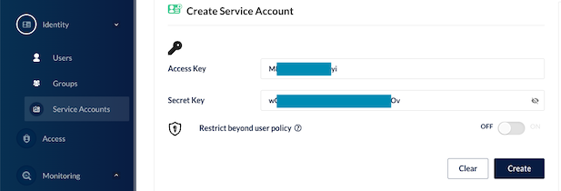

## Sample Todo App

- Deploy todo app to namespace todo with kustomize.
  
  ```bash
  oc create -k todo-kustomize/overlays/jvm
  ```
  Output

  ```bash
  namespace/todo created
  secret/todo-db created
  service/todo created
  service/todo-db created
  persistentvolumeclaim/todo-db created
  deployment.apps/todo created
  deployment.apps/todo-db created
  servicemonitor.monitoring.coreos.com/todo created
  route.route.openshift.io/todo created
  ```

- Add couple of your tasks to todo app
  
  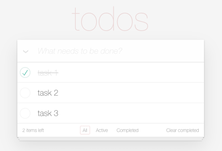
  
## OADP Operator

- Install OADP Operator from OperatorHub

  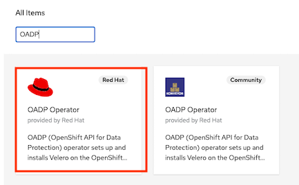

- Edit file [credentials-velero](credentials-velero) with ID and key of Service Account you created for tenant.

  ```ini
  [default]
  aws_access_key_id=<ID>
  aws_secret_access_key=<KEY>
  ```

- Create credentials for OADP to access MinIO bucket

  ```bash
  oc create secret generic cloud-credentials -n openshift-adp --from-file cloud=credentials-velero
  ```

- Create [DataProtectionApplication](DataProtectionApplication.yaml)

  ```yaml
  apiVersion: oadp.openshift.io/v1alpha1
  kind: DataProtectionApplication
  metadata:
    name: app-backup
    namespace: openshift-adp
  spec:
    configuration:
      velero:
        defaultPlugins:
          - aws 
          - openshift # Mandatory
      restic:
        enable: true # If you don't have CSI then you need to enable restic
    backupLocations:
      - velero:
          config:
            profile: "default"
            region: minio
            s3Url: http://minio.minio.svc.cluster.local:80 
            insecureSkipTLSVerify: "true"
            s3ForcePathStyle: "true"
          provider: aws
          default: true
          credential:
            key: cloud
            name: cloud-credentials # Default. Can be removed 
          objectStorage:
            bucket: cluster1
            prefix: oadp # Optional if this bucket use with more than app
  ```
  
  Run following command
  
  ```bash
  oc create -f DataProtectionApplication.yaml
  ```

- Verify that BackupStorageLocation is ready
  
  ```bash
  oc get BackupStorageLocation -n openshift-adp
  ```
  
  Output
  
  ```
  NAME           PHASE       LAST VALIDATED   AGE    DEFAULT
  app-backup-1   Available   36s              2m2s   true
  ```
  
  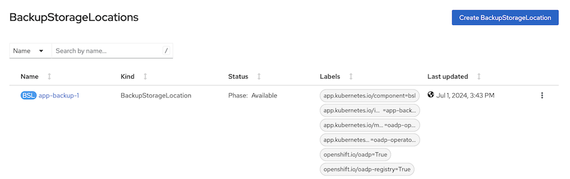

### Backup

- Create [backup configuration](backup-todo.yaml) for namespace todo

  ```yaml
  apiVersion: velero.io/v1
  kind: Backup
  metadata:
    name: todo
    labels:
      velero.io/storage-location: default
    namespace: openshift-adp
  spec:
    defaultVolumesToRestic: true
    hooks: {}
    includedNamespaces:
    - todo
    storageLocation: app-backup-1 
    ttl: 720h0m0s
  ```

  Run following command

  ```bash
  oc create -f backup-todo.yaml
  ```

- Verify backup status
  
  ```bash
  oc get backup/todo -n openshift-adp -o jsonpath='{.status}'|jq
  ```
  
  Output
  
  ```json
  {
    "completionTimestamp": "2022-08-30T09:50:00Z",
    "expiration": "2022-09-29T09:49:24Z",
    "formatVersion": "1.1.0",
    "phase": "Completed",
    "progress": {
      "itemsBackedUp": 69,
      "totalItems": 69
    },
    "startTimestamp": "2022-08-30T09:49:24Z",
    "version": 1
  }
  ```

- Check data in MinIO
  
  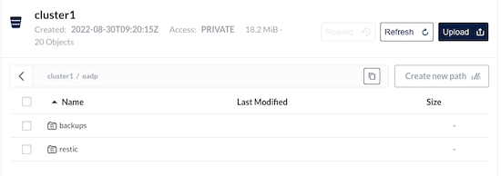

### Schedule Backup

- Create [schedule](schedule-todo.yaml) for backup namespace todo
  
  ```yaml
  apiVersion: velero.io/v1
  kind: Schedule
  metadata:
    name: todo
    namespace: openshift-adp
  spec:
    defaultVolumesToRestic: true
    schedule: 0 5 * * * #crontab format for schedule backup
    template:
      hooks: {}
      includedNamespaces:
      - todo
      storageLocation: app-backup-1 
      defaultVolumesToRestic: true 
      ttl: 720h0m0s
  ```

  Create schedule backup

  ```bash
  oc create -f schedule-todo.yaml
  ```
  
  - Check result after schedule is created. 
  ```bash
  oc get schedule/todo -n openshift-adp -o jsonpath='{.status}'   
  ```
  
  Output
  
  ```json
  {
    "lastBackup": "2022-08-30T13:51:32Z",
    "phase": "Enabled"
  }
  ```

### Restore
  
- Delete deployment and pvc in namespace todo
  ```bash
  oc delete deployment/todo-db -n todo
  oc delete pvc todo-db -n todo
  ```

- List backup name and select

  ```bash
  oc get backup -n openshift-adp
  ```
  
  Output
  
  ```bash
  NAME                  AGE
  todo                  3m18s
  todo-20220830135132   3m18s
  todo-20220830140034   3m18s
  todo-20220830141034   3m18s
  todo-20220830142634   18m
  ```

  Or use OpenShift Admin Console

  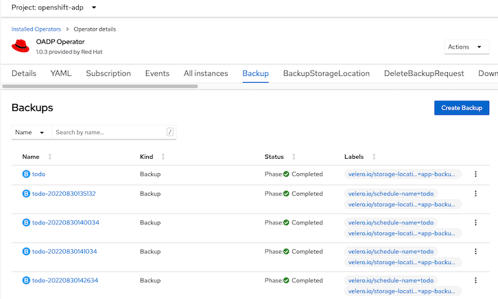

- Edit [restore-todo.yaml](restore-todo.yaml) and replace spec.backupName with name from previous step.
  
  ```yaml
  apiVersion: velero.io/v1
  kind: Restore
  metadata:
    name: todo
    namespace: openshift-adp
  spec:
    backupName: <backup name> 
    excludedResources:
    - nodes
    - events
    - events.events.k8s.io
    - backups.velero.io
    - restores.velero.io
    - resticrepositories.velero.io
    - route
    restorePVs: true
  ```
  
  Run following command
  
  ```bash
  oc create -f restore-todo.yaml
  ```
  
  Check for restore status
  
  ```bash
  oc get restore/todo -n openshift-adp -o yaml|grep -A8 'status:'
  ```

  Output
  
  ```yaml
  status:
    phase: InProgress
    progress:
      itemsRestored: 47
      totalItems: 47
    startTimestamp: "2022-08-30T14:28:53Z"
  ```
    
  Output when restoring process is completed
  
  ```yaml
  status:
    completionTimestamp: "2022-08-30T14:29:32Z"
    phase: Completed
    progress:
      itemsRestored: 47
      totalItems: 47
    startTimestamp: "2022-08-30T14:28:53Z"
    warnings: 5
  ```

- Verify todo apps.
